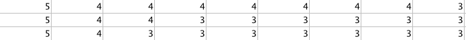
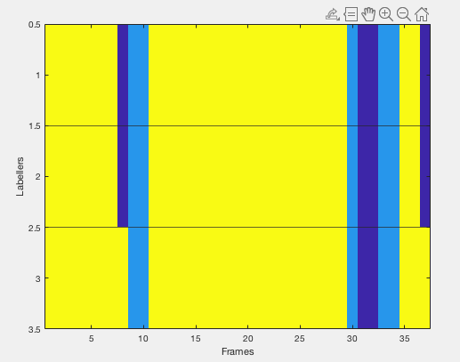

[](https://www.mathworks.com/matlabcentral/fileexchange/78023-fleiss-kappa-calculator-visualisation-of-video-annotations)
# Fleiss Kappa Calculator & Visualisation of Video Annotations

Fleiss' kappa (named after Joseph L. Fleiss) is a statistical measure for assessing the reliability of agreement between a fixed number of raters when assigning categorical ratings to a number of items or classifying items. Fleiss' kappa works for any number of raters giving categorical ratings, to a fixed number of items. It can be interpreted as expressing the extent to which the observed amount of agreement among raters exceeds what would be expected if all raters made their ratings completely randomly.

This tool was created by Jenil Shah for usage in DEVIATE Research @UMTRI to calculate the inter-rater reliability for annotated videos due to absence of any existing tool in Matlab implamentation. The tool does the following:

1.) Create a Visualisation for the Labelled Matrix to get a clearer understanding of the labellings. <br> 
2.) Converts a labelled video matrix into a Fleiss Matrix. <br>
3.) Calculate the Overall Fleiss Kappa Score, Percent Overall Agreement among raters above chance, Confidence Interval of Kappa & Siginificance Test of Kappas.

# Usage & Examples

The tool expects the annotations as a nxm matrix where n = number of labellers & m = frames. The (i,j) entry represents the category {1,2,3,4...} the ith labeller put for the jth frame. <br>
Note: Do not put 0 as a category. <br>
Note: We put in a non-labelled frame as 10 & count those as 1 category

<b>Example input:</b> 
  
Following is an Annotation Matrix for: 3 labellers annotate 9 frames for Head Position {3: Midline, 4: Weak Up, 5: Strong Up} <br><br>


<b> Usage: </b>

To create the visualisationn & calculate the Fleiss Kappa Value:
```
fleiss(#Number of Categories, AnnotationMatrix, Significance Level);
```
To only create the Fleiss Kappa Matrix:
```
Create_Fleiss_Matrix(#Number of Categories, AnnotationMatrix);
```
To only calculate Fleiss Kappa Score from Fleiss Kappa Matrix:
```
fleiss_score(FleissKappaMatrix, Significance Level);
```

<b> Outputs:</b> 
  
Visualisation of Frame labels into categories by multiple Labellers: <br> 


Fleiss Kappa Outputs: 

```
Percent Overall Agreement: 0.7613
Overall Fleiss Kappa Score: 0.6045
Substantial agreement by Landis & Koch(1997)

    Fleiss_Kappa    Std_Error    Confidence_Interval     z      p_value
    ____________    _________    ___________________    ____    _______

       0.6045       0.042272     0.58252    0.62648     14.3       0   

Reject null hypotesis: Observed agreement is not accidental
```
# Licenses 
MIT License

Copyright (c) 2020 jenilshah990
# Contributors
```
Cite As:
Jenil Shah (2020). Fleiss Kappa Calculator & Visualisation of Video Annotations (https://github.com/jenilshah990/FleissKappaCalculator/releases/tag/1.1.0), GitHub. Retrieved July 11, 2020.
